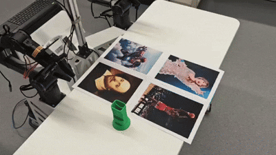

#### Note: This repository is currently undergoing refactoring, which is expected to be completed by December 4th. Please note that running the code at this time may result in errors.

<h3 align="center">
  <a href="https://github.com/zhijie-group/Mantis" style="color:#567053">Mantis: A Versatile Vision-Language-Action Model with Disentangled Visual Foresight</a>
</h3>

<h4 align="center"> 
  If you find our project helpful, please give us a star ⭐ to support us 🙏🙏
</h4>

  <a href="https://arxiv.org/pdf/2511.16175"><b>📄 Paper</b></a> |
  <a href="https://huggingface.co/collections/Yysrc/mantis"><b>🤗 Checkpoints</b></a> |
  <a href="./LICENSE"><b>📜 License</b></a>

## Table of Contents
- [🎥 Demos](#demos)
- [🤗 Models & Datasets](#models)
- [⚡ Quick Start](#getting_start)
- [📈 Evaluation](#evaluation)
- [🔧 Training](#training)
- [📚 Citation](#citation)

## 🎥 Demos
#### In-domain instructions (3x speed):
<table style="width:100%;border-collapse:collapse;table-layout: fixed">
<tr>
  <td style="text-align:center;width:33.33%;">Put the cup on the female singer</td>
  <td style="text-align:center;width:33.33%;">Put the cup on the Marval superhero</td>
  <td style="text-align:center;width:33.33%;">Put the watch in the basket</td>
</tr>
<tr>
  <td style="text-align:center;width:33.33%;"></td>
  <td style="text-align:center;width:33.33%;"></td>
  <td style="text-align:center;width:33.33%;"></td>
</tr>
<tr>
<table>

#### Out-of-domain instructions (3x speed):
<table style="width:100%;border-collapse:collapse;table-layout: fixed">
<tr>
  <td style="text-align:center;width:33.33%;">Put the cup on Taylor Swift</td>
  <td style="text-align:center;width:33.33%;">Put the cup on Iron Man</td>
  <td style="text-align:center;width:33.33%;">Put a thing that can tell the time in the basket</td>
</tr>
<tr>
  <td style="text-align:center;width:33.33%;"></td>
  <td style="text-align:center;width:33.33%;"></td>
  <td style="text-align:center;width:33.33%;"></td>
</tr>
<tr>
<table>

## 🤗 Models & Datasets
<table>
  <tr>
    <th>Model Name</th>
    <th>HF Path</th>
    <th>Note</th>
  </tr>
  <tr>
    <td>Mantis-Base</td>
    <td><a href="https://huggingface.co/Yysrc/Mantis-Base">Yysrc/Mantis-Base</a></td>
    <td>The Mantis base model after pretraining</td></td>
  </tr>
    <tr>
    <td> - </td>
    <td><a href="https://huggingface.co/qwbu/univla-latent-action-model">univla-latent-action-model</a></td>
    <td> actions.</td>
  </tr>
</table>
